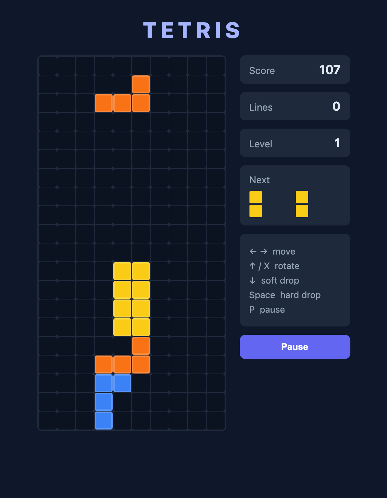

# React Tetris

A classic Tetris built with **React 18** and **vanilla JavaScript** — no game engine or
external game libraries. All the game logic (collision, rotation, line clears, scoring)
lives in a single `useReducer`, which keeps it predictable and easy to follow.



## Features

- 10×20 board with all **7 tetrominoes**, each with rotation (+ simple wall kicks)
- **Gravity** that speeds up as the level rises
- **Line clears**, scoring, level, and a **next-piece** preview
- Pause, game over, and restart
- Keyboard controls, fully client-side (no backend)

## Controls

| Key | Action |
|-----|--------|
| ← → | Move |
| ↑ / X | Rotate |
| ↓ | Soft drop |
| Space | Hard drop |
| P | Pause |
| Enter | Start / restart |

## Run locally

```bash
npm install
npm run dev      # http://localhost:5174
```

Build for production:

```bash
npm run build
```

## Tech & structure

React 18 · Vite · plain CSS.

```
src/
├── App.jsx            # layout + overlay
├── tetrominoes.js     # the 7 pieces and their colors
├── logic.js           # useReducer game logic (pure functions)
├── useTetris.js       # gravity loop + keyboard handling
└── components/        # Board, NextPiece
```
